<div align="center" style="font-weight: bold; font-size: 45px;">观点挖掘及社区发现实战</div>


**参考**

1. https://blog.csdn.net/m0_73689378/article/details/142344230?spm=1001.2014.3001.5506
2. https://github.com/qinyuenlp/CommunityDetection


# 一、观点挖掘

观点挖掘的主要任务：对**情感倾向**和情感对象进行抽取。

## （一）引入

同学们是否在大一期末的时候听过B站宋浩老师的高数课程？想必大家对下图的宋浩老师并不陌生，这是当年救我们的数学于水火之中的老师。

<center>
    
    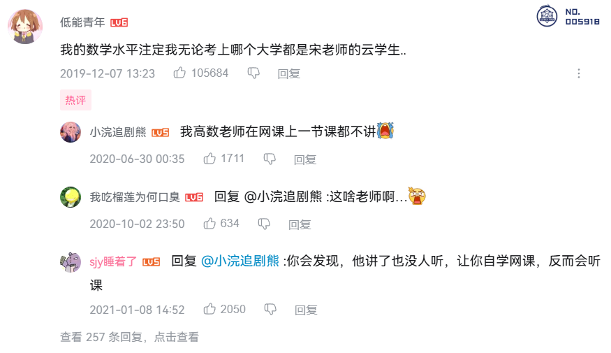
</center>


任务：通过爬虫爬取B站《宋浩老师的高数课》的评论，利用NLP的情感分析模型进行情感分析，并作出相应的可视化统计，**分析大学生在期末时候的心情是如何的，情感倾向是怎么样的**。

## （二）实战

### **1. 主要实验环境**

python 3.11，snownlp，matplotlib 3.9.3

### **2. 实验数据爬取**

基本原理：通过访问 Bilibili 视频评论的 API 接口，分页抓取评论数据，并将每条评论的信息提取并存储到 CSV 文件中。在爬取过程中，通过控制请求频率、异常处理以及停止条件来保证爬虫的稳定性和效率。

```python
import requests
import re
import time
import csv
import json

headers = {
    'User-Agent': 'Mozilla/5.0 (Windows NT 10.0; Win64; x64) AppleWebKit/537.36 (KHTML, like Gecko) Chrome/131.0.0.0 Safari/537.36'
}

def fetch_comments(video_id, max_pages=50):  # 最大页面数量可调整
    comments = []
    last_count = 0
    n = 1

    for page in range(1, max_pages + 1):
        url = f'https://api.bilibili.com/x/v2/reply/main?next={n}&type=1&oid={video_id}&mode=3'
        try:
            # 添加超时设置
            response = requests.get(url, headers=headers, timeout=10)
            if response.status_code == 200:
                data = response.json()
                print(page)
                if data['data']['replies'] == None:
                    break
                if data and 'replies' in data['data']:
                    for comment in data['data']['replies']:
                        comment_info = {
                            '用户昵称': comment['member']['uname'],
                            '评论内容': comment['content']['message'],
                            '被回复用户': '',
                            '评论层级': '一级评论',
                            '性别': comment['member']['sex'],
                            '用户当前等级': comment['member']['level_info']['current_level'],
                            '点赞数量': comment['like'],
                            '回复时间': time.strftime('%Y-%m-%d %H:%M:%S', time.localtime(comment['ctime']))
                        }
                        comments.append(comment_info)

                n += 1
                if last_count == len(comments):
                    break
                last_count = len(comments)
            else:
                break
        except requests.RequestException as e:
            print(f"请求出错: {e}")
            break
        # 控制请求频率
        time.sleep(1)
    return comments


def save_comments_to_csv(comments, video_bv):
    with open(f'./result/{video_bv}.csv', mode='w', encoding='utf-8',
              newline='') as file:
        writer = csv.DictWriter(file,
                                fieldnames=['用户昵称', '性别', '评论内容', '被回复用户', '评论层级', '用户当前等级',
                                            '点赞数量', '回复时间'])
        writer.writeheader()
        for comment in comments:
            writer.writerow(comment)

def sanitize_filename(filename):
    # 移除文件名中的特殊字符
    return re.sub(r'[\\/*?:"<>|]', "", filename)

video_name = '《高等数学》同济版 2024年更新|宋浩老师'  # 视频名字
video_bv = 'BV1Eb411u7Fw'  # video_bv
print(f'视频名字: {video_name}, video_bv: {video_bv}')
comments = fetch_comments(video_bv)
sanitized_video_name = sanitize_filename(video_name)  # 清理文件名
save_comments_to_csv(comments, sanitized_video_name)  # 会将所有评论保存到一个csv文件
```

其他工具（非编程）：八爪鱼等

**最终数据：**（爬取了1000条评论数据，总共有7w+条评论）

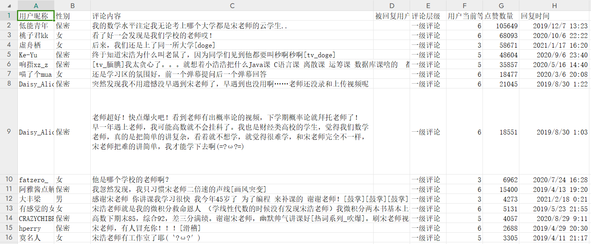

### 3. 数据预处理

去重，去除停用词、特殊符号，按使用要求进行分段、分句。

### 4. 情感分析

编程：SnowNLP 是一个简单易用的 Python 库，专为处理中文文本而设计。它基于自然语言处理技术，提供了多种功能，包括分词、词性标注、情感分析、文本转换（简繁转换）等。

非编程：SPSSAU等

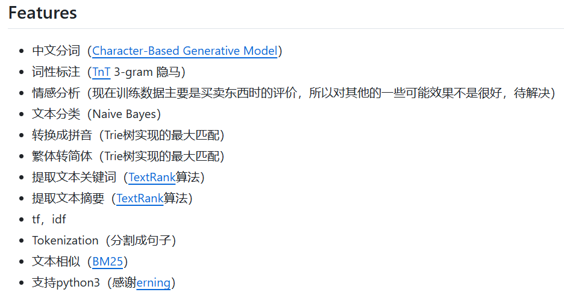

```python
import pandas as pd
import jieba
from snownlp import SnowNLP

# 1. 读取CSV文件
df = pd.read_csv('《高等数学》同济版 2024年更新宋浩老师.csv')

# 2. 情感分析
def sentiment_analysis(text):
    s = SnowNLP(text)
    score = s.sentiments  # 获取情感得分
    return score

# 3. 根据情感得分划分等级
def get_sentiment_level(score):
    if score < 0.4:
        return '消极'
    elif score > 0.6:
        return '积极'
    else:
        return '中性'

# 4. 处理评论并添加分数和等级
df['分数'] = df['评论内容'].apply(sentiment_analysis)  # 情感分析得分
df['等级'] = df['分数'].apply(get_sentiment_level)  # 根据得分确定等级

# 5. 保存到新的文件
df.to_csv('高等数学同济版2024年更新宋浩老师_情感分析.csv', index=False)

print("情感分析完成并保存为新的文件")
```

**结果：**爬取了1000条视频下面的评论

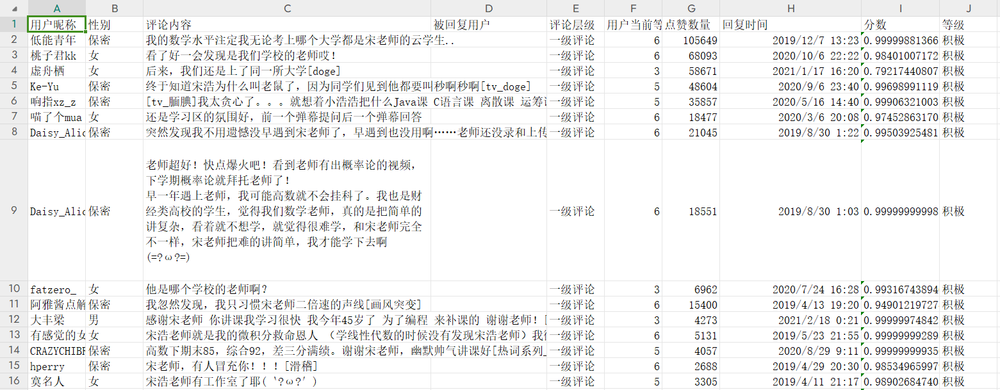

### 5. 情感分析结果可视化

（1）情感分数区间的频次统计

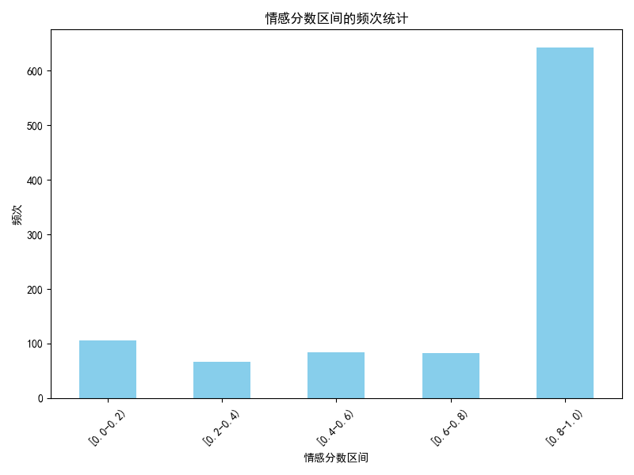

（2）等级比例

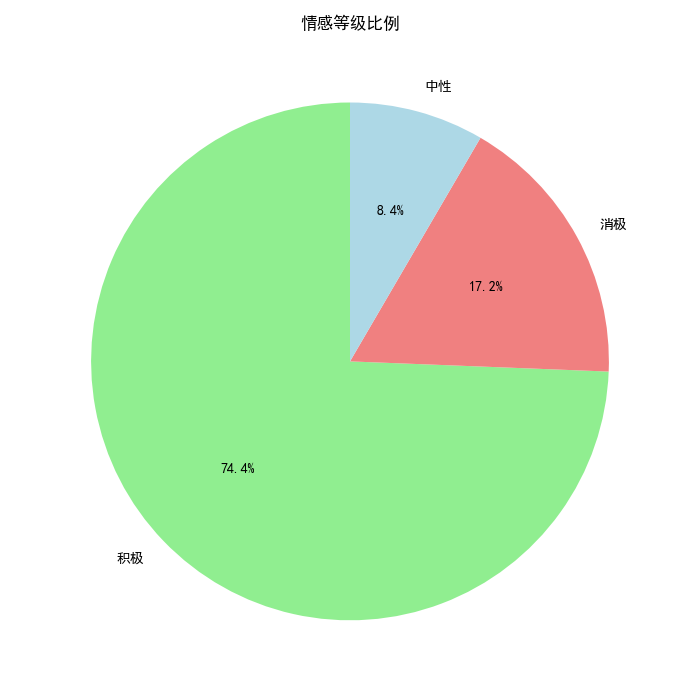

（3）情感分数分布

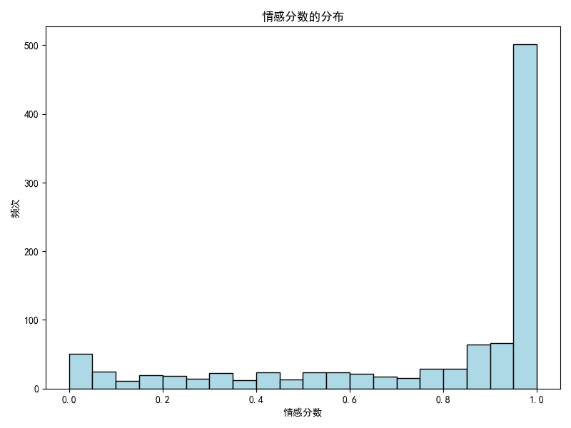

（4）消极评论示例

| 用户             | 评论                                                         |
| :--------------- | ------------------------------------------------------------ |
| 帅气退场         | 用我前任十年单身换在座的各位高数考过[OK]                     |
| 洋洋然i          | 洛必达只是图一乐，真求极限还得看拼多多砍价 笑死我了这个弹幕  |
| 绿川由依         | 老师！！还有一个月考试！！！！您快更新鸭！！！！！！！！！（发出了救命的声音 |
| randomsight      | 高考考完，网上一搜，买了同济版的高等数学，到货了就趴床上看，这一看我的眉头是一拧一松，一拧一松，然后就是一拧到底了。。。。。 |
| 我永远喜欢DRA    | 想给那些刷“ⅹⅹx别卷了”的人，一人一拳                          |
| Balabalance      | 为啥这么多人刷名字？？？入站考试白考了（                     |
| isXiYoui         | 大哥们，请您别发XX放弃吧，别学了，您觉得有意思么？？？       |
| Amituofo啊咿呀呦 | 有点不太懂，某些人哈，你觉得无聊你就睡觉，你觉得幼稚你就换课，你觉得啰嗦你就快进，没了你这课还是会继续上，没了你谁也不是不行，为什么你就偏偏要说一些难听的话来人身攻击呢？就是为了刷一刷你那少的可怜的存在感么 |

类似总结性质的评论会被判定为消极：

| 用户           | 评论                                                         |
| -------------- | ------------------------------------------------------------ |
| 窑帅哥AxelForm | 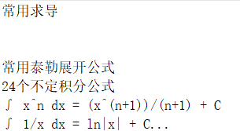 |
| An阿良         | 卡在奇怪的地方                                               |
| 陪我去下雨     | 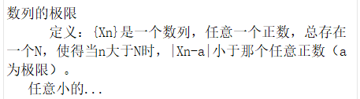 |

（5）中性评论示例

| 用户       | 评论                               |
| ---------- | ---------------------------------- |
| 月上泛云雾 | 用我单身换在座各位高数必过[doge]   |
| 你的爷爷6  | 开学补考的在我这里集合[doge]       |
| 早濑沐歌   | 我发现我听课的时候会特别认真的走神 |
| 账号已注销 | 要是改成播放时长，高数绝对第一     |
| 玄冰同学   | 1000+晚自习是吧[doge_金箍]         |

（6）积极评论示例

| 用户        | 评论                                                         |
| ----------- | ------------------------------------------------------------ |
| 桃子君kk    | 看了好一会发现是我们学校的老师哎！                           |
| 虚舟栖      | 后来，我们还是上了同一所大学[doge]                           |
| Ke-Yu       | 终于知道宋浩为什么叫老鼠了，因为同学们见到他都要叫秒啊秒啊[tv_doge] |
| Daisy_Alice | 突然发现我不用遗憾没早遇到宋老师了，早遇到也没用啊……老师还没录和上传视频呢 |
| Daisy_Alice | 老师超好！快点爆火吧！看到老师有出概率论的视频，下学期概率论就拜托老师了！ |
| C--Pandora  | 高数期末满分前来还原[给心心]                                 |

**（7）文本情感分析分类有部分错误的地方原因？**

a. SnowNLP的情感分析模型数据训练主要是在“买卖东西时的评价”上进行的，对此直接作出迁移实验，虽然能达到较好的效果，但有相对错误的地方。

b. 设置的阈值可能会有影响。


**（8）如何改进？或者其他的方法？**

**方法一：**利用一些较新的预训练模型（如BERT等）进行微调，构建自己设计的模型，并专门针对B站的评论进行情感分析任务的训练，最终对于当前任务的效果将会更好。

**方法二：**利用当前的LLM（大语言模型），调用他们的API进行文本的情感分析。

**方法三：**LLM和自己设计的模型结合，寻找最新的文本情感分析模型迁移应用、训练等。


### 6. 其他可视化

（1）单字


（2）去除单字


（3）用户等级

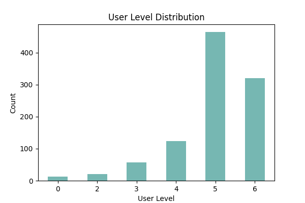


# 二、社区发现

## （一）引入

在社交媒体中（小红书，QQ，抖音等），同学们是否发现平台会给你推荐你熟悉的人？

<center>
    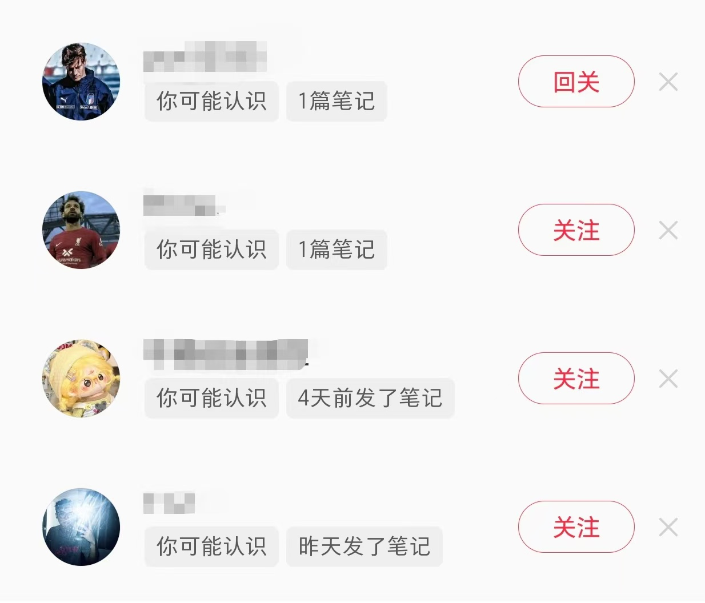
    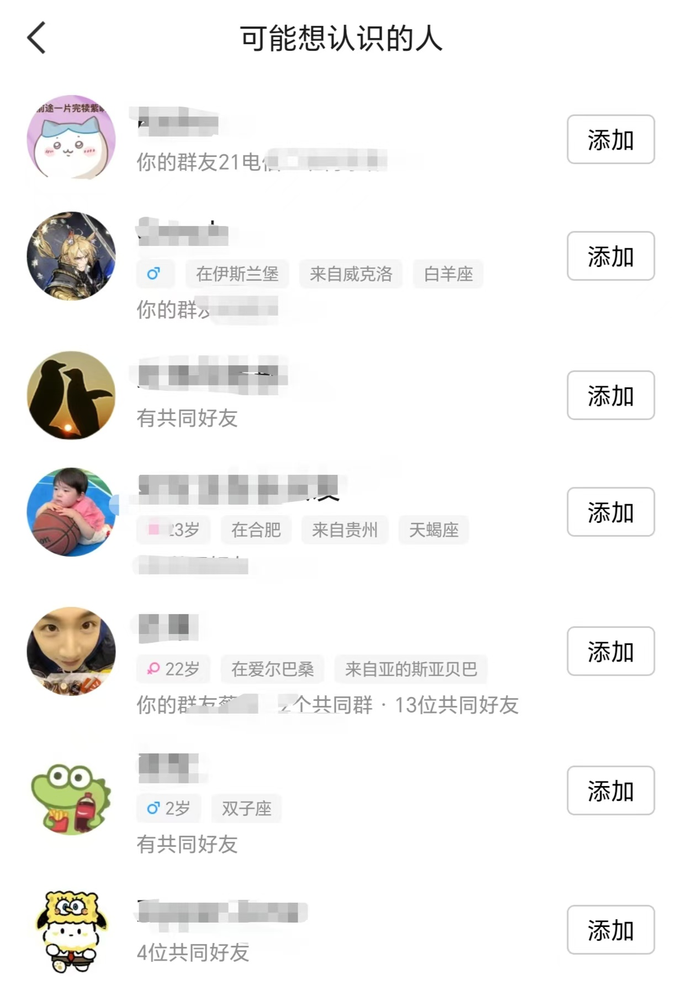
</center>


在淘宝，京东等购物APP中，是否发现他会给你推荐朋友感兴趣的东西，你最近在谈论的东西呢？


这个就是社区的概念：

​		 社区发现是一件很有意义的事情。以社交网络为例，社区结构是客观存在的，但某个社区内的某个用户只和那些与其有直接边相连的用户产生互动，殊不知，在这个社区内，他和那些与其没有直接边相连的用户其实也很“近”，如果要做好友推荐，属于同一社区的用户之间应该优先进行推荐。此外，“物以类聚，人以群分”，对一个大型网络调用社区发现算法，其实是对其按照某种标准进行了划分，在此基础上可对每个社区做进一步的发掘。而从计算的角度而言，社区分划相当于分解了任务，起到了降低计算复杂度的作用。

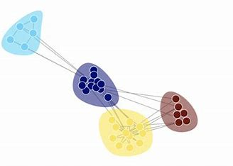

## （二）实战

**实验所用数据集：**football数据集（美国大学橄榄球联盟的比赛数据集）

football网络根据美国大学生足球联赛而创建的一个复杂的社会网络.该网络包含 115个节点和 613条边,其中网络中的结点代表足球队,两个结点之间的边表示两只球队之间进行过一场比赛.参赛的115支大学生代表队被分为12个联盟。**比赛的流程是联盟内部的球队先进行小组赛,然后再是联盟之间球队的比赛。**

<center>
    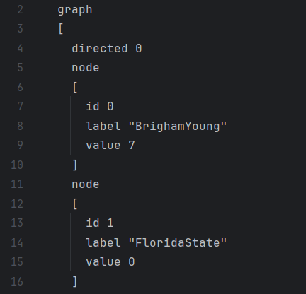
    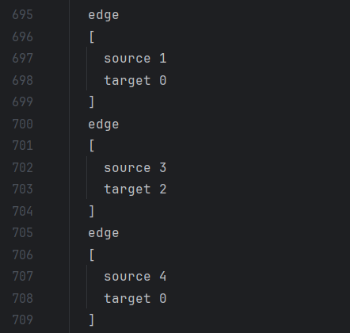
**任务**：知道每个人的姓名（node中的label，id），以及和谁交锋过（edge），要求把这些人分别分到不同的社区，要求社区内部人的联系更多，而社区间的联系较少。

**主要实验环境：**python 3.11，networkx 3.4.2，scikit-learn 1.5.2，matplotlib 3.9.3


## （三）实战：聚类算法

谱聚类算法：利用图的**拉普拉斯矩阵**或**相似性矩阵**以及机器学习中的聚类算法进行节点的聚类，也就是进行**社区发现**。

### 1. 加载图数据

```python
filepath = r'./data/football.gml'
G = nx.read_gml(filepath)
```

**输入：**一个 GML 文件（在此示例中是 football.gml），包含图的结构数据。
**输出：**图 G 被加载到 **NetworkX 图对象**中，包含了节点和边的信息。

### 2. 执行谱聚类算法

```python
k = 12
sc_com = SpectralClustering.partition(G, k)  # 谱聚类
print(sc_com)
```

**目的：**使用谱聚类算法将图 G 划分为 k=12 个社区。

**算法核心：**

（1）构建图的邻接矩阵和度矩阵

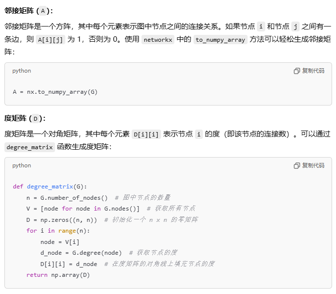

（2）计算拉普拉斯矩阵

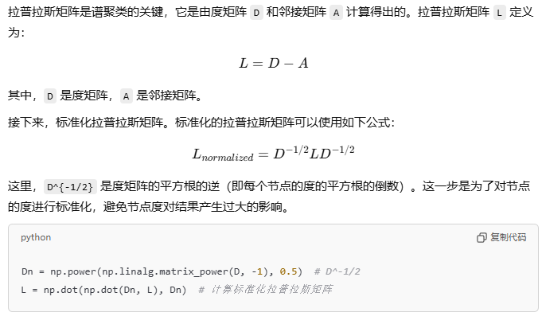

（3）特征值分解

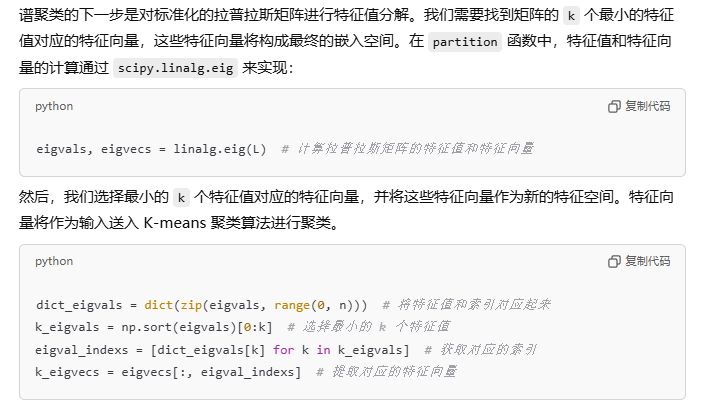

每个node都会对应一个特征向量：表示图中一个节点在 k 个特征向量空间中的坐标。

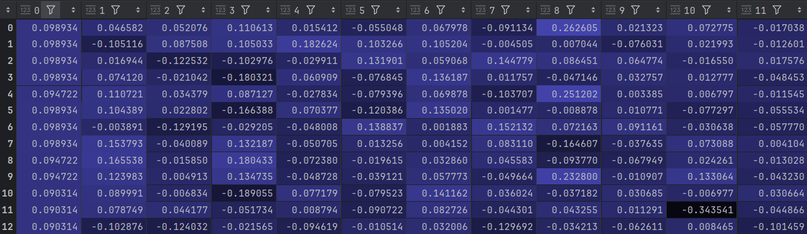

（4）K-means聚类

**目的：**K-means 聚类算法将这些节点的特征向量划分为 `k` 个簇。每个簇代表一个社区，簇的中心是特征向量空间中的一个“聚集点”。

**步骤：**

1. 对于给定的一组数据，随机初始化K个聚类中心（簇中心）
2. 计算每个数据到簇中心的距离（一般采用欧氏距离），并把该数据归为离它最近的簇。
3. 根据得到的簇，重新计算簇中心。
4. 对步骤2、步骤3进行迭代直至簇中心不再改变或者小于指定阈值。

<center>
    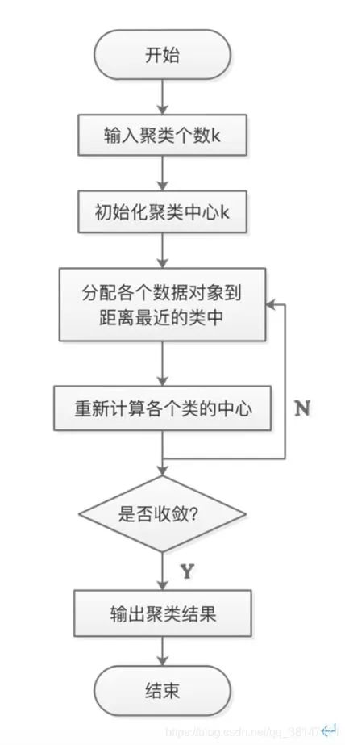
    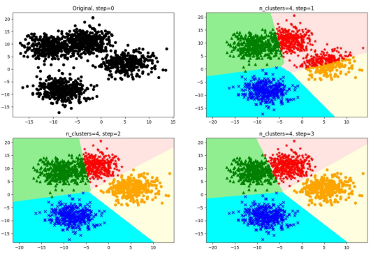
</center>


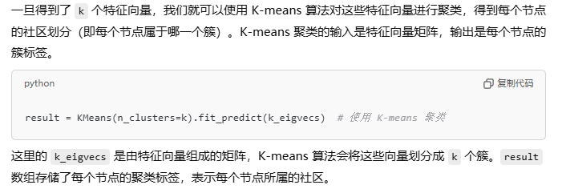

result示例：

| id   | value |
| ---- | ----- |
| 0    | 7     |
| 1    | 3     |
| 2    | 5     |

### 3. 可视化初步图

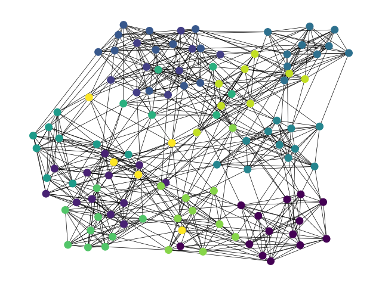

### 4. 进一步可视化处理

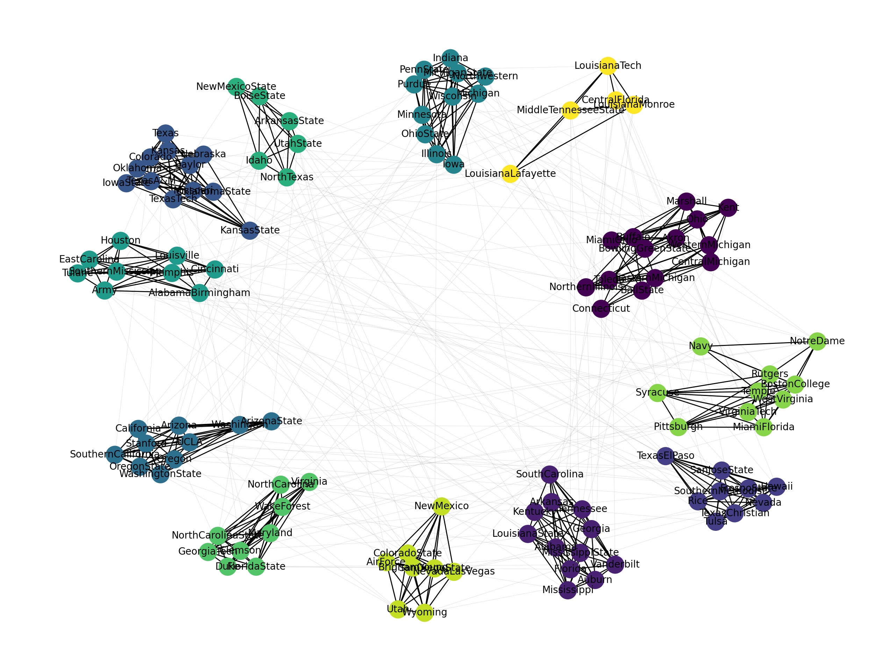

模块度：0.6905165407471078

模块度：是一个**用于衡量社区划分效果的指标。**模块度是用来评估一个图中的社区划分是否合理的指标，数值越大，表示社区划分的效果越好。模块度的取值范围通常是 [-1, 1]，值越接近 1，表示社区划分越符合预期，即同一社区内的节点连接越紧密，社区之间的连接越稀疏。

### （四）实战：GN算法

**Girvan-Newman (GN) 算法**: 是基于边介数中心性（edge betweenness centrality）的方法，它通过逐渐移除图中边介数最高的边来分离社区。这个过程直到图被拆分成多个不连通的部分为止。


模块度：0.5996290274077957


# 三、工具分享

**1. 大模型：**智谱清言，文心一言，ChatGPT

**2. 爬虫工具：**八爪鱼，Python等

**3. 数据分析工具**：SPSS，SPSSPRO，SPSSAU

**4. 深度学习课程推荐**：吴恩达，李沐，李宏毅，斯坦福大学相关课程

**5. 网络建模工具：**

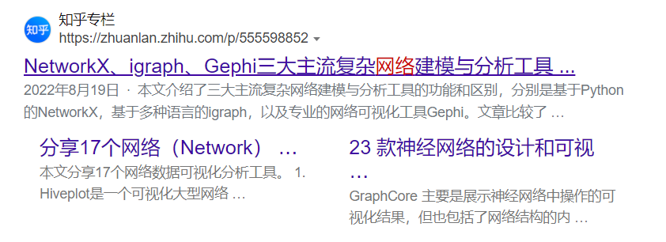

项目地址：https://github.com/wyy122/Sentiment-Analysis-and-Community-Detection


**参考**

1. https://blog.csdn.net/m0_73689378/article/details/142344230?spm=1001.2014.3001.5506
2. https://github.com/qinyuenlp/CommunityDetection
